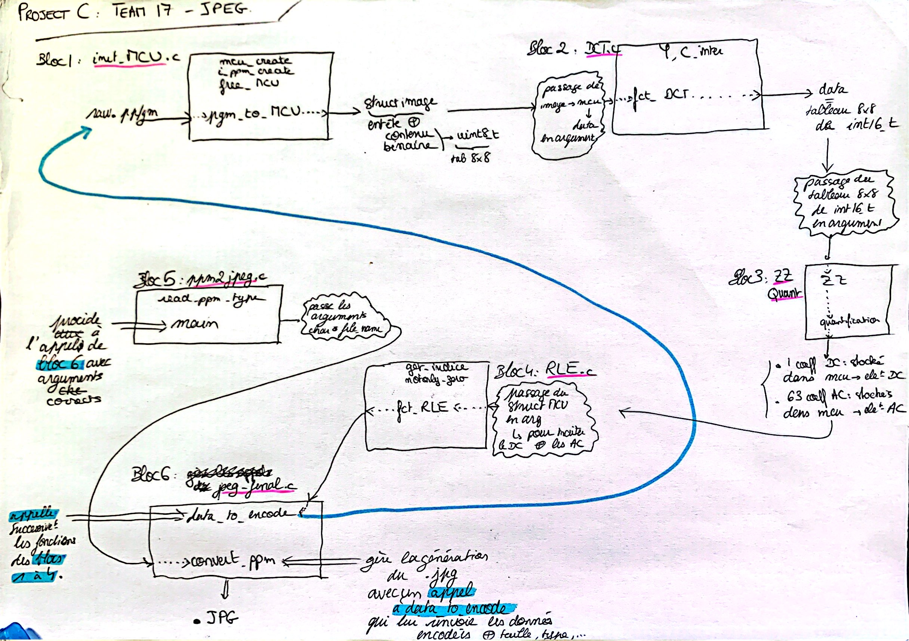

# Notre encodeur JPEG à nous

Bienvenue sur la page d'accueil de _votre_ projet JPEG, un grand espace de liberté, sous le regard bienveillant de vos enseignants préférés.
Le sujet sera disponible à l'adresse suivante : [https://formationc.pages.ensimag.fr/projet/jpeg/jpeg/](https://formationc.pages.ensimag.fr/projet/jpeg/jpeg/).

*Première étape : convertisseur PGM vers JPEG*

*->* choisir une Structure de Données pour les tableaux de pixels

*->* implémenter les fonctions : lecture de l'entête du PGM, lecture de la pixel map pour initialiser le(s) MCU(s)    (utilisation d'une struct qui contient les infos récupérées sur l'entête)   (pour le moment, pgm de taille 8x8 donc uniquement un MCU de taille 8x8), passage de RGB vers YCbCr (ici, uniquement Y), DCT en place sur un unique MCU donné, puis Zig-Zag sur un seul MCU pour obtenir un unique vecteur 64x1, puis étape de quantification avec la table de quantification donnée sous la forme 64x1.

**Voici un schéma qui résume les structures de données choisies, ainsi que le fonctionnement global de notre programme : **

# Liens utiles

- Bien former ses messages de commits : [https://www.conventionalcommits.org/en/v1.0.0/](https://www.conventionalcommits.org/en/v1.0.0/) ;
- Problème relationnel au sein du groupe ? Contactez [Pascal](https://fr.wikipedia.org/wiki/Pascal,_le_grand_fr%C3%A8re) !
- Besoin de prendre l'air ? Le [Mont Rachais](https://fr.wikipedia.org/wiki/Mont_Rachais) est accessible à pieds depuis la salle E301 !
- Un peu juste sur le projet à quelques heures de la deadline ? Le [Montrachet](https://www.vinatis.com/achat-vin-puligny-montrachet) peut faire passer l'envie à vos profs de vous mettre une tôle !
